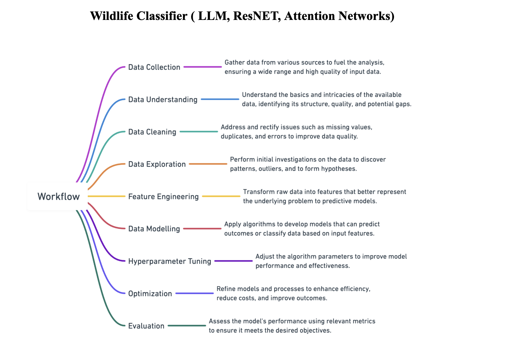
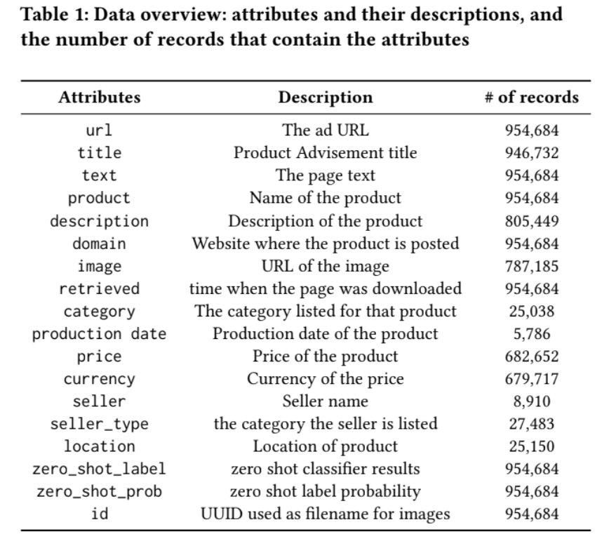
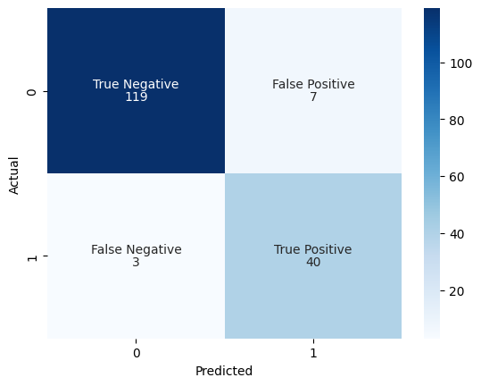

# Assets

This folder stores the visual materials used across the project documentation and presentation.

## Included Files

- `Workflow.png`
- `Features.png`
- `Model_evaluation.png`

## Project Workflow

High-level overview of the data collection, preprocessing, feature extraction, and modeling pipeline.

## Feature Overview

Summary of the feature groups used in the wildlife trafficking detection workflow.

## Model Evaluation

Visualization of evaluation results and model performance.

## Usage

These images are used in the repository documentation and can also be referenced from the root `README.md` using paths such as:

- `assets/Workflow.jpg`
- `assets/Features.jpg`
- `assets/Model_evaluation.jpg`
